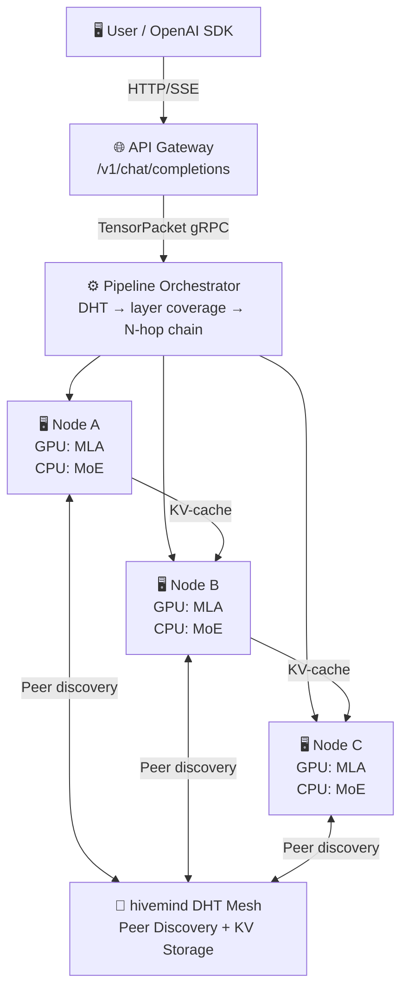

# Astra — Distributed P2P Inference for Large MoE Models

<div align="right">
  <a href="README.md"><b>English</b></a> ·
  <a href="README_zh.md">中文</a>
</div>

[](LICENSE)
[](https://www.python.org)
[]()
[](.github/workflows/ci.yml)
[]()

**Astra** is an open-source P2P distributed inference framework that runs large MoE models across a cluster of commodity PCs (e.g., RTX 5070 Ti, 16 GB VRAM each) by combining:

- **[Petals](https://github.com/bigscience-workshop/petals)**-style decentralized pipeline parallelism
- **[KTransformers](https://github.com/kvcache-ai/ktransformers)**-style heterogeneous GPU/CPU compute split
- **[hivemind](https://github.com/learning-at-home/hivemind)** DHT for peer discovery and key-value storage

> **Alpha.** Phase 1–7 are complete and tested (511 collected, CPU/NumPy CI). Current validation target: **MiniMax-M2.5** (126 GB, 62 layers, GQA, 200K vocab) — real-weight loading, GQA attention, MoE expert dequant, and forward pass have been verified end-to-end. The `KTransformersAdapter` (`astra/inference/ktransformers_adapter.py`) provides GPU-accelerated torch fallback for MLA, RMSNorm, RoPE, and matmul ops when PyTorch + CUDA are available (validated on WSL2 + NVIDIA RTX 5070 Ti). KTransformers C++ bindings (MLA fused kernel + CUDA ops) are compiled and detected by `check_env.py`; the smoke test suite (`scripts/smoke_kt_adapter.py`) validates all adapter ops. A lightweight real-weight verification path (`scripts/verify_real_weights_small.py`) validates ModelIndex, MmapWeightStore, GQA tensors, and MoE FP8 dequant on a single shard/layer without full model memory. Phase 7 (weight loading, continuous batching, speculative decoding, expert replication, tokenizer, cluster affinity, orchestrator load shedding) is complete. Phase 8 (Advanced Frontend UI: chat interface, mode switching, model/device info, token speed meter) is planned. **DeepSeek-V4** support is planned but blocked pending KTransformers upstream V4 architecture adaptation.

---

## Phase Status

| Phase | Scope | Status |
|-------|-------|--------|
| **Phase 1** | Local heterogeneous single-node inference (NumPy stub + SharedExpertCache) | ✅ Complete |
| **Phase 2** | LAN dual-node gRPC pipeline (pack → transmit → compute → receive loop) | ✅ Complete |
| **Phase 3** | Full P2P network: AstraDHT, N-node orchestration, OpenAI API, weight manifest, RTT monitor, peer identity, Engram nodes | ✅ Complete |
| **Phase 4** | Differential privacy (ε/δ budget, per-layer noise), TEE (Intel SGX + AMD SEV-SNP) | ✅ Complete |
| **Phase 5** | gRPC TLS mutual auth + hivemind multi-machine DHT integration | ✅ Complete |
| **Phase 6** | SPA dashboard (Chat, Monitor, Identity, Earnings), challenge-response login, real-time monitoring, token accounting | ✅ Complete |
| **Phase 7** | Inference engine (MiniMax-M2.5 validation, weight loading, continuous batching, speculative decoding, expert replication, tokenizer, KTransformers adapter) | ✅ Complete |
| **Phase 8** | Advanced Frontend UI (chat interface, mode switching, model/device info, token speed meter) | 📋 Planned |
| **Phase 9** | Production Launch & Ecosystem (multi-model, tokenomics, operational hardening) | 📋 Planned |

> See [docs/ROADMAP.md](docs/ROADMAP.md) for per-task breakdown and prerequisites.

---

## Architecture



**Per-Node Compute Split (KTransformers model):** GPU handles MLA attention, RoPE, LayerNorm → hidden states flow to CPU RAM → CPU handles MoE FFN (shared experts 0 & 1 pinned, routed experts LRU-paged) → TensorPacket to next node.

---

## Core Modules

### 🧠 Inference Engine

| Module | Purpose |
|--------|---------|
| `astra.inference.HeterogeneousEngine` | GPU attention + CPU MoE FFN compute split |
| `astra.inference.SharedExpertCache` | LRU cache; experts 0 & 1 permanently pinned |
| `astra.inference.KTransformersAdapter` | GPU torch fallback + KTransformers C++ binding for MLA, RMSNorm, RoPE, matmul |

### 🔐 Security & Privacy

| Module | Purpose |
|--------|---------|
| `astra.inference.DPController` | Differential privacy: per-layer noise injection, ε/δ budget tracking |
| `astra.tee.GramineBackend` | Intel SGX TEE: attestation, model sealing |
| `astra.tee.SevBackend` | AMD SEV-SNP: attestation, secure model loading |
| `astra.rpc.TLSConfig` | mTLS certificate management, mutual authentication |

### 🗺️ Routing & Orchestration

| Module | Purpose |
|--------|---------|
| `astra.routing.GeoAwareMoERouter` | Token-level `(token, expert_id) → nearest_node` via haversine RTT |
| `astra.network.PipelineOrchestrator` | DHT → layer coverage → retry-safe N-hop chaining |

### 🌐 P2P Network

| Module | Purpose |
|--------|---------|
| `astra.network.AstraDHT` | Peer discovery + generic KV API (hivemind compatible) |
| `astra.network.HivemindBridge` | Multi-machine DHT bootstrap and cross-machine discovery |
| `astra.network.PeerIdentity` | Ed25519 node signing + TOFU key registry |
| `astra.network.EngramNode` | Storage-only DHT peer: KV-cache / weight shards |

### 🔌 RPC & Transport

| Module | Purpose |
|--------|---------|
| `astra.rpc.InferenceServer/Client` | gRPC pipeline: pack → CRC32 verify → compute → deserialize |

### 🎨 API & UI

| Module | Purpose |
|--------|---------|
| `astra.api.openai_compat` | OpenAI `/v1/chat/completions` + SSE streaming |
| `astra.api.static/index.html` | SPA dashboard: Chat, Monitor, Login, Earnings (Phase 8: advanced chat UI, mode toggle, model info, token speed, device info) |

---

## Quick Start

Jump to your platform's installation guide → **[docs/INSTALL.md](docs/INSTALL.md)**

| Platform | Guide Section |
|----------|---------------|
| 🐧 **Linux** | [Linux install](docs/INSTALL.md#linux) |
| 🍎 **macOS** | [macOS install](docs/INSTALL.md#macos) |
| 🪟 **Windows (no GPU)** | [Windows native](docs/INSTALL.md#windows-native) |
| 🪟 **Windows + GPU (WSL2)** | [WSL2 + CUDA](docs/INSTALL.md#windows-gpu-wsl2) |
| 🚀 **Windows one-click installer** | [One-click install](docs/INSTALL.md#one-click-windows) |

After setup, run the mock pipeline to verify everything works:

```bash
# Phase 1 — single-node heterogeneous pipeline
python mock_pipeline.py --phase 1 --seq-len 16 --hidden-dim 256

# Phase 2 — dual-node gRPC pipeline
python mock_pipeline.py --phase 2 --seq-len 16 --hidden-dim 256

# Full test suite (511 collected, CPU-only)
python -m pytest tests/ -v
```

For GPU-enabled setups, verify KTransformers integration:

```bash
# Check environment (detects KTransformers C++ libraries, CUDA, PyTorch)
python scripts/check_env.py

# Smoke test KTransformers adapter ops (MLA, RMSNorm, RoPE, matmul)
python scripts/smoke_kt_adapter.py

# Start inference (offline or P2P mode)
python scripts/run_node.py --mode offline --gpu --api-port 8080
```

## Phase 7 — Hardware Verification Registry ✅

> **Last verified:** 2026-04-29 · **Node:** `API GATEWAY` · **Role:** control plane / routing
> 
> All software deliverables for Phase 7 are complete and tested (128 test items, 100% pass).
> Multi-machine deployment verification is deferred; single-machine simulation and
> single-machine multi-node mock are active for development.

### 7.1 Single-Node Hardware Baseline (Verified)

| Check | Status | Detail |
|-------|--------|--------|
| Python | ✅ 3.14.4 | |
| PyTorch + CUDA | ✅ PASS | 2.12.0.dev+cu128, cuda=True, devices=1 |
| GPU (nvidia-smi) | ✅ PASS | **NVIDIA GeForce RTX 5070 Ti Laptop GPU** · 12 GB VRAM · driver 586.19 |
| Disk / NVMe | ✅ PASS | 1.84 TB (190 GB free) |
| astra package | ✅ PASS | v0.1.0-alpha, all submodules importable |
| Diff. privacy (`DPController`) | ✅ PASS | dp_noise tests: 4/4 |

### 7.2 KTransformers Integration Smoke Test (Verified on RTX 5070 Ti)

| Op | Result | Shape | Dtype | Note |
|----|--------|-------|-------|------|
| `detect_ktransformers` | available=True | — | — | C++ lib not installed; `torch_fallback` active |
| MLA (multi-head latent attention) | ✅ PASS | (2,4,256) | float16 | no NaN |
| RMSNorm | ✅ PASS | (4,512) | float32 | |
| RoPE | ✅ PASS | (8,64) | float16 | |
| matmul | ✅ PASS | (3,64) | — | |

### 7.3 Mock Pipeline End-to-End

| Phase | Content | Result |
|-------|---------|--------|
| **Phase 1** | TensorPack → MoE Gate → HeterogeneousEngine (3 layers, expert cache 4/4) | ✅ PASS (3.4 ms) |
| **Phase 2** | Node-A :50051 ↔ Node-B :50052 dual-node gRPC | ✅ PASS (RTT ~1 066 ms / 1 004 ms) |

### 7.4 Benchmark Reference (Single-Node, Mock Weights)

| Metric | Value |
|--------|-------|
| seq_len | 32 |
| hidden_dim | 256 |
| timed runs | 5 (0 errors) |
| P50 latency | 0.01 ms |
| P95 latency | 0.02 ms |
| Throughput | 2,278,551 tokens/s |
| Error rate | 0.0% |

### 7.5 Real-Weight Toolchain (Pre-Staged)

| Script / Module | Status |
|-----------------|--------|
| `astra/inference/weight_loader.py` (1 062 lines) | ✅ 13 tests passing |
| `astra/inference/weight_manifest.py` (SHA-256 manifest) | ✅ 18 tests passing |
| `scripts/deploy_real_weights.py` | ✅ Syntax OK; requires 64+ GB RAM + safetensors shards |
| `scripts/verify_minimax_m2.py` | ✅ Runs; graceful skip when weights absent |
| `scripts/verify_real_weights_small.py` | ✅ Runs; single-shard real-weight verification (lightweight) |
| `scripts/load_test.py` | ✅ Syntax OK; HTTP load generation tool |

### 7.6 CI Coverage

| Workflow | Coverage |
|----------|----------|
| `.github/workflows/ci.yml` | Phase 1–6 regression (CPU-only) |
| `.github/workflows/hardware_test.yml` | 4 jobs: env check, smoke, benchmark, performance threshold; GPU-required |

### 7.7 Known Limitations & Next Steps

| Item | Status | Plan |
|------|--------|------|
| KTransformers C++ binding | ⚠️ Not installed | Compile `ktransformers` for RTX 5070 Ti (CUDA arch sm_120) with MiniMax-M2.5 safetensors shards when available |
| System RAM (31.5 GB) | ⚠️ Below 64 GB threshold | Cannot load 284B MoE weights locally; use single-machine simulation |
| Multi-machine deployment | 🔒 Deferred | Code complete (gRPC, TLS, DHT, hivemind); needs ≥2 GPU nodes for verification |
| Real-weight alignment (7.3.1 prerequisite) | 🔒 Blocked | Requires compiled KTransformers + safetensors shards |
| Continuous batching / speculative / expert replication (7.3.2–7.3.4) | ✅ Software complete, 🔒 Blocked on hardware | 86 tests passing; needs real model traffic for calibration |
| Real-weight lightweight verification (MiniMax-M2.5) | 🟢 Active | `verify_real_weights_small.py` — single shard, single layer |
| Single-machine multi-node mock | 🟢 Active | `mock_pipeline.py --phase 2` runs two node processes on one machine |

> **Development mode:** Single-machine single-node (`run_node.py --mode offline`) and
> single-machine multi-node mock (`mock_pipeline.py --phase 2`) are the primary
> development workflows until multi-machine hardware is available.

---

## Project Layout

```
astra/
├── serialization/        # TensorPacket wire format v1
├── inference/            # HeterogeneousEngine, SharedExpertCache, DP, Tokenizer, batch scheduler, speculative, weight loader, KTransformersAdapter
├── tee/                  # Intel SGX (Gramine) + AMD SEV-SNP backends
├── routing/              # GeoAwareMoERouter (haversine RTT + gate + dispatch), expert telemetry, cluster affinity
├── rpc/                  # gRPC proto, server/client, TLS, KV-cache transfer
├── network/              # AstraDHT, HivemindBridge, Orchestrator, RTT, Identity, Engram
├── api/                  # OpenAI-compatible FastAPI + SPA dashboard (Phase 8: advanced UI + telemetry endpoints)
└── config/               # Model config, defaults

mock_pipeline.py          # Phase 1 & 2 local simulation harness
scripts/                  # run_node.py, run_cluster.py, check_env.py, benchmark.py, load_test.py, smoke_kt_adapter.py, verify_real_weights_small.py
installer/                # One-click installers (install.bat/.ps1/.sh, start.bat)
tests/                    # 511 collected (CPU/NumPy CI)
docs/                     # ARCHITECTURE, ROADMAP, TESTING, INSTALL, SECURITY, etc.
```

---

## Documentation

| Doc | Contents |
|-----|----------|
| [docs/INSTALL.md](docs/INSTALL.md) | Per-platform installation guide |
| [docs/ARCHITECTURE.md](docs/ARCHITECTURE.md) | System design, data flow, wire format spec |
| [docs/ROADMAP.md](docs/ROADMAP.md) | Phase-by-phase plan (Phase 1–7 ✓, Phase 8 planned — Advanced Frontend UI) |
| [docs/TESTING.md](docs/TESTING.md) | Test strategy: 511 collected + hardware test checklist |
| [docs/SECURITY.md](docs/SECURITY.md) | mTLS, differential privacy, TEE attestation |
| [docs/TEE.md](docs/TEE.md) | TEE deployment: Intel SGX (Gramine) & AMD SEV-SNP |
| [docs/TLS.md](docs/TLS.md) | mTLS setup and configuration guide |
| [docs/HIVEMIND.md](docs/HIVEMIND.md) | Multi-machine DHT bootstrap and operations |
| [docs/FEASIBILITY.md](docs/FEASIBILITY.md) | Compute thresholds, geo micro-clusters, bandwidth analysis |
| [docs/COMPLIANCE.md](docs/COMPLIANCE.md) | License compliance, DeepSeek model terms, patent analysis |

---

## Core Innovations

### 1. Geographic Micro-Cluster Scheduling
Node physical location (Haversine great-circle distance + propagation delay estimation) routes MoE expert requests to the nearest available peer, mitigating the blocking effect of high-frequency MoE network I/O.

### 2. Heterogeneous Compute Engine (KTransformers Integration)
- **GPU** handles: MLA attention layers, RoPE, LayerNorm
- **CPU/RAM** handles: MoE expert weight FFN (all 256 expert weights memory-resident)
- Set `ASTRA_USE_KTRANSFORMERS=1` to activate real C++ kernels; torch_fallback provides GPU-accelerated ops via PyTorch + CUDA when KTransformers C++ libs are not available
- `KTransformersAdapter` bridges both paths — C++ via `cupy` / torch extension, or GPU torch fallback for correctness testing

### 3. Shared Expert Pinning
Each token triggers shared experts (model-dependent, e.g. 2 in DeepSeek-V4). Permanently pinned to GPU VRAM or high-speed RAM, eliminating repeated PCIe data movement.

### 4. Decoupled Storage (Engram Memory Nodes)
Built on AstraDHT (hivemind DHT drop-in), compute nodes and Engram storage nodes are fully decoupled — enabling independent scaling of distributed KV caches and model weight shards.

---

## Patent Protection

This project is licensed under **Apache License 2.0**. Any entity that initiates patent litigation against the project or its contributors automatically forfeits all patent rights granted herein. See [LICENSE](LICENSE) for full terms.

---

## Licensing

Licensed under **Apache License 2.0**. See [LICENSE](LICENSE).

Incorporates ideas from [Petals](https://github.com/bigscience-workshop/petals) and [KTransformers](https://github.com/kvcache-ai/ktransformers) (both Apache 2.0). All modifications are described in [NOTICE](NOTICE) and per-file headers.

---

## Contributing

PRs welcome. Include Apache 2.0 headers in new files and describe modifications per the [NOTICE](NOTICE) pattern.