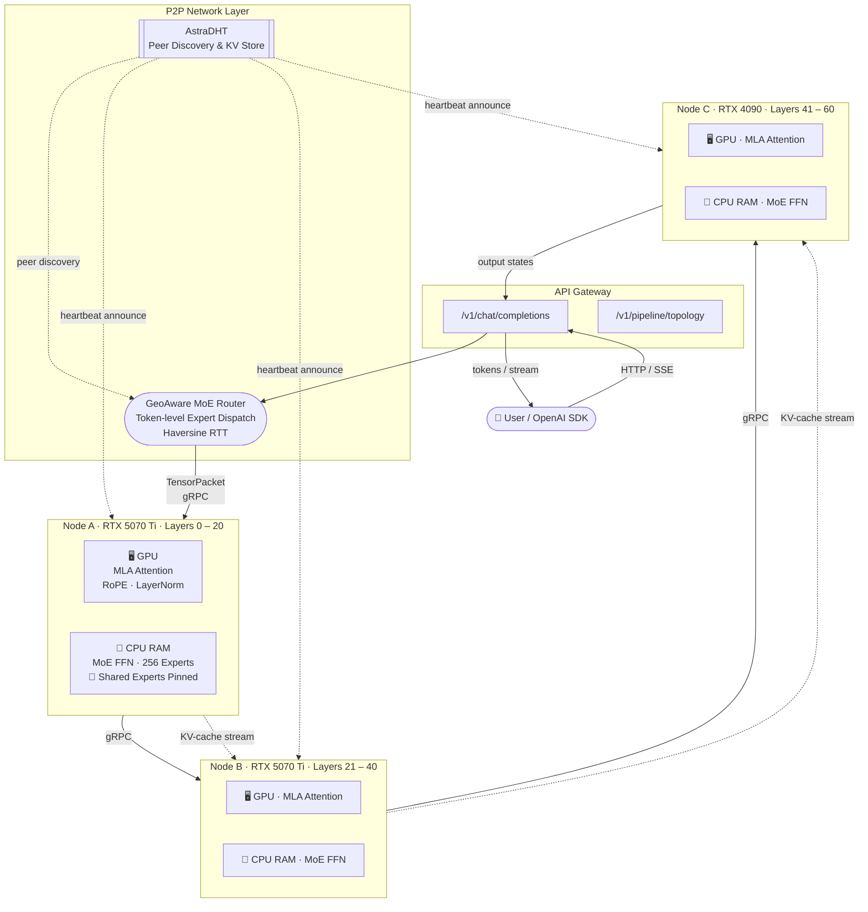

# Astra — Distributed P2P Inference for DeepSeek-V4

<div align="right">
  <a href="README.md"><b>English</b></a> ·
  <a href="README_zh.md">中文</a>
</div>

[](LICENSE)
[](https://www.python.org)
[]()
[](.github/workflows/ci.yml)
[]()

**Astra** is an open-source P2P distributed inference framework that runs **DeepSeek-V4-Flash (284B)** across a cluster of commodity PCs (e.g., RTX 5070 Ti, 16 GB VRAM each) by combining:

- **[Petals](https://github.com/bigscience-workshop/petals)**-style decentralized pipeline parallelism
- **[KTransformers](https://github.com/kvcache-ai/ktransformers)**-style heterogeneous GPU/CPU compute split
- **[hivemind](https://github.com/learning-at-home/hivemind)** DHT for peer discovery and key-value storage

> **Alpha.** Phase 1 & 2 (local + dual-node gRPC pipeline) are complete and tested. Phase 3 (full P2P network + API gateway) is in progress.

---

## Platform Support

| Component | Linux | macOS | Windows |
|-----------|:-----:|:-----:|:-------:|
| numpy stub (no GPU) | ✅ Native | ✅ Native | ✅ Native |
| gRPC pipeline | ✅ Native | ✅ Native | ✅ Native |
| OpenAI API gateway | ✅ Native | ✅ Native | ✅ Native |
| `check_env.py` | ✅ Native | ✅ Native | ✅ Native |
| KTransformers C++ kernel | ✅ Native | ⚠️ Build from source | ⚠️ WSL2 + CUDA |

**GPU inference on Windows** requires WSL2 — see the [step-by-step guide](#windows--gpu-inference-via-wsl2) below.  
**numpy stub mode** (no GPU) runs natively on all three platforms without any additional setup.

---

## Quick Start

Jump to your platform:
- [Linux](#linux)
- [macOS](#macos)
- [Windows — no GPU (native)](#windows--no-gpu-native)
- [Windows — GPU inference via WSL2](#windows--gpu-inference-via-wsl2)

---

### Linux

```bash
# 1. Clone and install
git clone https://github.com/qchauncey/astra.git && cd astra
pip install -e ".[proto]"

# 2. Check your environment
python scripts/check_env.py

# 3. Run the mock pipeline (no GPU required)
python mock_pipeline.py --seq-len 32 --hidden-dim 256

# 4. Start a node (OpenAI-compatible API on port 8080)
#    --hidden-dim 256 uses mock dimensions; omit for the real model (7168)
python scripts/run_node.py --node-id node-A --port 50051 \
    --layer-start 0 --layer-end 30 --hidden-dim 256 --api-port 8080

# 5. GPU mode (requires CUDA + KTransformers)
python scripts/run_node.py --node-id node-A --port 50051 \
    --layer-start 0 --layer-end 30 --gpu --api-port 8080
```

---

### macOS

Astra runs fully on macOS in numpy stub mode (CPU-only). KTransformers C++ kernels require CUDA and are not available on Apple Silicon or Intel Mac.

```bash
# Install Homebrew if needed (https://brew.sh)
brew install python@3.11 git

git clone https://github.com/qchauncey/astra.git && cd astra
pip3 install -e ".[proto]"

python scripts/check_env.py
python mock_pipeline.py --seq-len 32 --hidden-dim 256

# Start a node (numpy stub, no GPU)
python scripts/run_node.py --node-id node-A --port 50051 \
    --layer-start 0 --layer-end 30 --hidden-dim 256 --api-port 8080
```

> **Apple Silicon note:** MPS (Metal Performance Shaders) backend is not yet integrated. Full GPU inference on Mac requires a future MPS adapter. Contributions welcome.

---

### Windows — No GPU (native)

Run directly in PowerShell or Command Prompt. No WSL2 required for the numpy stub.

```powershell
# Install Python 3.10+ from https://python.org (check "Add to PATH")
# Install Git from https://git-scm.com

git clone https://github.com/qchauncey/astra.git
cd astra
pip install -e ".[proto]"

python scripts/check_env.py
python mock_pipeline.py --seq-len 32 --hidden-dim 256

# Start a node (numpy stub, no GPU)
python scripts/run_node.py --node-id node-A --port 50051 `
    --layer-start 0 --layer-end 30 --hidden-dim 256 --api-port 8080
```

---

### Windows — GPU Inference via WSL2

KTransformers requires Linux + CUDA. On Windows, WSL2 provides a full Linux kernel with GPU passthrough — Astra runs identically to native Linux inside it.

**Prerequisites**
- Windows 10 version 21H2 or later / Windows 11
- NVIDIA GPU with driver ≥ 535 (verify in PowerShell: `nvidia-smi`)

**Step 1 — Enable WSL2** *(PowerShell as Administrator)*

```powershell
wsl --install -d Ubuntu-22.04
# Restart Windows when prompted, then open "Ubuntu 22.04" from the Start menu
```

**Step 2 — Install the NVIDIA WSL2 CUDA driver** *(on Windows host, not inside WSL)*

1. Download the WSL2-compatible display driver from: https://developer.nvidia.com/cuda/wsl  
2. Install it on **Windows** as a normal driver update.  
3. Do **not** install the CUDA Toolkit on Windows — it lives inside WSL2 only.

**Step 3 — Install CUDA Toolkit inside WSL2 Ubuntu**

```bash
# Run these inside the WSL2 Ubuntu terminal
wget https://developer.download.nvidia.com/compute/cuda/repos/ubuntu2204/x86_64/cuda-keyring_1.1-1_all.deb
sudo dpkg -i cuda-keyring_1.1-1_all.deb
sudo apt-get update
sudo apt-get install -y cuda-toolkit-12-4 build-essential python3-pip git

# Verify the GPU is visible
nvidia-smi
```

Expected output: your GPU name, driver version, and CUDA version.

**Step 4 — Clone and run Astra inside WSL2**

```bash
git clone https://github.com/qchauncey/astra.git && cd astra
pip3 install -e ".[proto]"

# Environment check
python scripts/check_env.py

# Mock pipeline (CPU-only, sanity check)
python mock_pipeline.py --seq-len 32 --hidden-dim 256

# Start a node with GPU enabled
python scripts/run_node.py --node-id node-A --port 50051 \
    --layer-start 0 --layer-end 30 --gpu --api-port 8080
```

**WSL2 tips**

| Topic | Detail |
|-------|--------|
| Accessing Windows files | Available at `/mnt/c/`, `/mnt/d/`, etc. inside WSL2 |
| Network | WSL2 ports are accessible from Windows at `localhost:<port>` — no extra config |
| GPU driver | Shared from Windows host; do **not** install a GPU driver inside WSL2 |
| Multi-machine | Each Windows machine runs its own WSL2; gRPC pipeline works identically to Linux |
| Performance | ~3–5% overhead vs bare-metal Linux; negligible for memory-bound MoE workloads |

---

## Architecture

### Network Topology



### Per-Node Compute Split (KTransformers Model)

```
┌─────────────────────────────────────────────────────────┐
│                  Single Astra Node                       │
│                                                          │
│  ┌─────────────── GPU (16 GB VRAM) ──────────────────┐  │
│  │  Multi-Latent Attention (MLA)                      │  │
│  │  ├─ Q / K / V projections   (fused CUDA kernel)   │  │
│  │  ├─ RoPE positional encoding                       │  │
│  │  ├─ Scaled dot-product attention                   │  │
│  │  └─ Output projection + residual                   │  │
│  └────────────────────────────────────────────────────┘  │
│                         │ hidden states (float16)         │
│                         ▼                                 │
│  ┌─────────────── CPU RAM (≥ 64 GB) ─────────────────┐  │
│  │  MoE FFN  (KTransformers CPU offload)              │  │
│  │  ├─ Shared Experts 0 & 1  ← PINNED, never evicted │  │
│  │  ├─ Routed Experts 2–255  ← LRU-paged from NVMe   │  │
│  │  └─ SiLU-gated MLP: down( silu(gate(x)) * up(x) ) │  │
│  └────────────────────────────────────────────────────┘  │
│                         │ TensorPacket (gRPC)             │
│                         ▼  next node                      │
└─────────────────────────────────────────────────────────┘
```

### Hardware Requirements per Node

| Sub-layer | Device | Memory |
|-----------|--------|--------|
| MLA Attention + RoPE + LayerNorm | GPU VRAM | ~16 GB |
| Shared experts 0 & 1 (fire every token) | Pinned GPU / fast RAM | ~2 GB |
| 254 routed MoE experts (top-8 per token) | CPU RAM / NVMe mmap | ~530 GB across cluster |
| KV cache (per request) | CPU RAM | ~8 GB @ 8k ctx |

---

## Project Layout

```
astra/
├── serialization/
│   └── tensor_pack.py          # TensorPacket wire format v1
├── inference/
│   ├── heterogeneous.py        # HeterogeneousEngine (GPU attn + CPU MoE)
│   └── shared_expert_cache.py  # LRU expert cache with permanent pinning
├── routing/
│   └── geo_router.py           # GeoAwareMoERouter (token-level dispatch)
├── rpc/
│   ├── proto/inference.proto   # gRPC service definition
│   ├── generated/              # auto-generated pb2 stubs
│   ├── server.py               # InferenceServer
│   ├── client.py               # InferenceClient (pack → transmit → receive)
│   └── kv_transfer.py          # KV-cache chunked streaming
├── network/
│   ├── dht.py                  # AstraDHT — hivemind drop-in peer discovery
│   └── orchestrator.py         # PipelineOrchestrator — N-node DHT chaining
└── api/
    └── openai_compat.py        # OpenAI-compatible FastAPI endpoint

mock_pipeline.py                # Phase 1 & 2 local simulation harness
scripts/
├── run_node.py                 # Production node launch CLI
└── check_env.py                # Environment readiness checker
tests/                          # 130 pytest tests (all passing)
.github/workflows/ci.yml        # CI: Python 3.10/3.11/3.12 matrix + lint
docs/
├── ARCHITECTURE.md             # Detailed design & wire format spec
└── ROADMAP.md                  # Phase-by-phase implementation plan
```

---

## Module Overview

| Module | Purpose |
|--------|---------|
| `astra.serialization.TensorPacket` | Binary wire format: hidden states + routing metadata, float16 |
| `astra.inference.HeterogeneousEngine` | Attention on GPU stub · MoE FFN on CPU RAM |
| `astra.inference.SharedExpertCache` | LRU cache; experts 0 & 1 pinned, never evicted |
| `astra.routing.GeoAwareMoERouter` | Token-level `(token, expert_id) → best_node` via haversine RTT |
| `astra.rpc.InferenceServer/Client` | gRPC pack → CRC32 verify → compute → deserialize loop |
| `astra.rpc.KVCacheSender/Receiver` | Chunked KV tensor streaming between pipeline stages |
| `astra.network.AstraDHT` | Peer discovery; drop-in for `hivemind.DHT` |
| `astra.network.PipelineOrchestrator` | DHT → layer coverage → retry-safe N-hop chaining |
| `astra.api.openai_compat` | OpenAI `/v1/chat/completions` + SSE streaming |

---

## Documentation

| Doc | Contents |
|-----|----------|
| [docs/ARCHITECTURE.md](docs/ARCHITECTURE.md) | System design, data flow, wire format spec |
| [docs/ROADMAP.md](docs/ROADMAP.md) | Phase-by-phase plan (Phase 1 ✓ · Phase 2 ✓ · Phase 3 in progress) |
| [docs/TESTING.md](docs/TESTING.md) | Test strategy: 130 tests covered + pending hardware test checklist |
| [docs/SECURITY.md](docs/SECURITY.md) | mTLS encryption, differential privacy, output tamper-proofing |
| [docs/FEASIBILITY.md](docs/FEASIBILITY.md) | Compute thresholds, geo micro-cluster tiers, bandwidth analysis |
| [docs/COMPLIANCE.md](docs/COMPLIANCE.md) | License compliance, DeepSeek model terms, patent analysis |

---

## Licensing

Licensed under **Apache License 2.0**. See [LICENSE](LICENSE).

Incorporates ideas from [Petals](https://github.com/bigscience-workshop/petals) and [KTransformers](https://github.com/kvcache-ai/ktransformers) (both Apache 2.0). All modifications are described in [NOTICE](NOTICE) and per-file headers.

---

## Contributing

PRs welcome. Include Apache 2.0 headers in new files and describe modifications per the [NOTICE](NOTICE) pattern.
