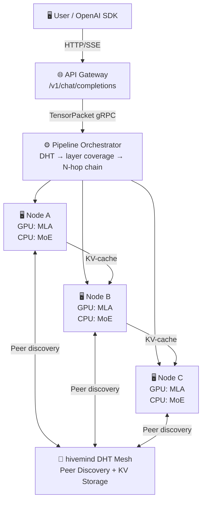

# Astra — Distributed P2P Inference for Large MoE Models

<div align="right">
  <a href="README.md"><b>English</b></a> ·
  <a href="README_zh.md">中文</a>
</div>

[](LICENSE)
[](https://www.python.org)
[]()
[](.github/workflows/ci.yml)
[]()

**Astra** is an open-source P2P distributed inference framework that runs large MoE models across a cluster of commodity PCs (e.g., RTX 5070 Ti, 16 GB VRAM each) by combining:

- **[Petals](https://github.com/bigscience-workshop/petals)**-style decentralized pipeline parallelism
- **[KTransformers](https://github.com/kvcache-ai/ktransformers)**-style heterogeneous GPU/CPU compute split
- **[hivemind](https://github.com/learning-at-home/hivemind)** DHT for peer discovery and key-value storage

> **Alpha.** Phase 1–7 are complete and tested (498 passed, 1 skipped, all passing on CPU/NumPy CI). Current validation target: **MiniMax-M2.5** (126 GB, 62 layers, GQA, 200K vocab) — real-weight loading, GQA attention, MoE expert dequant, and forward pass have been verified end-to-end. Phase 7 (weight loading, continuous batching, speculative decoding, expert replication, tokenizer) is complete with MiniMax-M2.5 as the primary benchmark. **DeepSeek-V4** support is planned but blocked pending KTransformers upstream V4 architecture adaptation.

---

## Phase Status

| Phase | Scope | Status |
|-------|-------|--------|
| **Phase 1** | Local heterogeneous single-node inference (NumPy stub + SharedExpertCache) | ✅ Complete |
| **Phase 2** | LAN dual-node gRPC pipeline (pack → transmit → compute → receive loop) | ✅ Complete |
| **Phase 3** | Full P2P network: AstraDHT, N-node orchestration, OpenAI API, weight manifest, RTT monitor, peer identity, Engram nodes | ✅ Complete |
| **Phase 4** | Differential privacy (ε/δ budget, per-layer noise), TEE (Intel SGX + AMD SEV-SNP) | ✅ Complete |
| **Phase 5** | gRPC TLS mutual auth + hivemind multi-machine DHT integration | ✅ Complete |
| **Phase 6** | SPA dashboard (Chat, Monitor, Identity, Earnings), challenge-response login, real-time monitoring, token accounting | ✅ Complete |
| **Phase 7** | Inference engine (MiniMax-M2.5 validation, weight loading, continuous batching, speculative decoding, expert replication, tokenizer) | ✅ Complete |

> See [docs/ROADMAP.md](docs/ROADMAP.md) for per-task breakdown and prerequisites.

---

## Architecture



**Per-Node Compute Split (KTransformers model):** GPU handles MLA attention, RoPE, LayerNorm → hidden states flow to CPU RAM → CPU handles MoE FFN (shared experts 0 & 1 pinned, routed experts LRU-paged) → TensorPacket to next node.

---

## Core Modules

### 🧠 Inference Engine

| Module | Purpose |
|--------|---------|
| `astra.inference.HeterogeneousEngine` | GPU attention + CPU MoE FFN compute split |
| `astra.inference.SharedExpertCache` | LRU cache; experts 0 & 1 permanently pinned |

### 🔐 Security & Privacy

| Module | Purpose |
|--------|---------|
| `astra.inference.DPController` | Differential privacy: per-layer noise injection, ε/δ budget tracking |
| `astra.tee.GramineBackend` | Intel SGX TEE: attestation, model sealing |
| `astra.tee.SevBackend` | AMD SEV-SNP: attestation, secure model loading |
| `astra.rpc.TLSConfig` | mTLS certificate management, mutual authentication |

### 🗺️ Routing & Orchestration

| Module | Purpose |
|--------|---------|
| `astra.routing.GeoAwareMoERouter` | Token-level `(token, expert_id) → nearest_node` via haversine RTT |
| `astra.network.PipelineOrchestrator` | DHT → layer coverage → retry-safe N-hop chaining |

### 🌐 P2P Network

| Module | Purpose |
|--------|---------|
| `astra.network.AstraDHT` | Peer discovery + generic KV API (hivemind compatible) |
| `astra.network.HivemindBridge` | Multi-machine DHT bootstrap and cross-machine discovery |
| `astra.network.PeerIdentity` | Ed25519 node signing + TOFU key registry |
| `astra.network.EngramNode` | Storage-only DHT peer: KV-cache / weight shards |

### 🔌 RPC & Transport

| Module | Purpose |
|--------|---------|
| `astra.rpc.InferenceServer/Client` | gRPC pipeline: pack → CRC32 verify → compute → deserialize |

### 🎨 API & UI

| Module | Purpose |
|--------|---------|
| `astra.api.openai_compat` | OpenAI `/v1/chat/completions` + SSE streaming |
| `astra.api.static/index.html` | SPA dashboard: Chat, Monitor, Login, Earnings |

---

## Quick Start

Jump to your platform's installation guide → **[docs/INSTALL.md](docs/INSTALL.md)**

| Platform | Guide Section |
|----------|---------------|
| 🐧 **Linux** | [Linux install](docs/INSTALL.md#linux) |
| 🍎 **macOS** | [macOS install](docs/INSTALL.md#macos) |
| 🪟 **Windows (no GPU)** | [Windows native](docs/INSTALL.md#windows-native) |
| 🪟 **Windows + GPU (WSL2)** | [WSL2 + CUDA](docs/INSTALL.md#windows-gpu-wsl2) |
| 🚀 **Windows one-click installer** | [One-click install](docs/INSTALL.md#one-click-windows) |

After setup, run the mock pipeline to verify everything works:

```bash
# Phase 1 — single-node heterogeneous pipeline
python mock_pipeline.py --phase 1 --seq-len 16 --hidden-dim 256

# Phase 2 — dual-node gRPC pipeline
python mock_pipeline.py --phase 2 --seq-len 16 --hidden-dim 256

# Full test suite (498 passed, 1 skipped, CPU-only)
python -m pytest tests/ -v
```

---

## Project Layout

```
astra/
├── serialization/        # TensorPacket wire format v1
├── inference/            # HeterogeneousEngine, SharedExpertCache, DP, Tokenizer, batch scheduler, speculative, weight loader
├── tee/                  # Intel SGX (Gramine) + AMD SEV-SNP backends
├── routing/              # GeoAwareMoERouter (haversine RTT + gate + dispatch), expert telemetry, cluster affinity
├── rpc/                  # gRPC proto, server/client, TLS, KV-cache transfer
├── network/              # AstraDHT, HivemindBridge, Orchestrator, RTT, Identity, Engram
├── api/                  # OpenAI-compatible FastAPI + SPA dashboard
└── config/               # Model config, defaults

mock_pipeline.py          # Phase 1 & 2 local simulation harness
scripts/                  # run_node.py, run_cluster.py, check_env.py, benchmark.py, load_test.py
installer/                # One-click installers (install.bat/.ps1/.sh, start.bat)
tests/                    # 498 pytest tests + 1 skipped (all passing on CPU/NumPy CI)
docs/                     # ARCHITECTURE, ROADMAP, TESTING, INSTALL, SECURITY, etc.
```

---

## Documentation

| Doc | Contents |
|-----|----------|
| [docs/INSTALL.md](docs/INSTALL.md) | Per-platform installation guide |
| [docs/ARCHITECTURE.md](docs/ARCHITECTURE.md) | System design, data flow, wire format spec |
| [docs/ROADMAP.md](docs/ROADMAP.md) | Phase-by-phase plan (Phase 1–7 ✓ — MiniMax-M2.5 validation, continuous batching, speculative decoding, expert replication, weight loading, tokenizer) |
| [docs/TESTING.md](docs/TESTING.md) | Test strategy: 498 tests + hardware test checklist |
| [docs/SECURITY.md](docs/SECURITY.md) | mTLS, differential privacy, TEE attestation |
| [docs/TEE.md](docs/TEE.md) | TEE deployment: Intel SGX (Gramine) & AMD SEV-SNP |
| [docs/TLS.md](docs/TLS.md) | mTLS setup and configuration guide |
| [docs/HIVEMIND.md](docs/HIVEMIND.md) | Multi-machine DHT bootstrap and operations |
| [docs/FEASIBILITY.md](docs/FEASIBILITY.md) | Compute thresholds, geo micro-clusters, bandwidth analysis |
| [docs/COMPLIANCE.md](docs/COMPLIANCE.md) | License compliance, DeepSeek model terms, patent analysis |

---

## Core Innovations

### 1. Geographic Micro-Cluster Scheduling
Node physical location (Haversine great-circle distance + propagation delay estimation) routes MoE expert requests to the nearest available peer, mitigating the blocking effect of high-frequency MoE network I/O.

### 2. Heterogeneous Compute Engine (KTransformers Integration)
- **GPU** handles: MLA attention layers, RoPE, LayerNorm
- **CPU/RAM** handles: MoE expert weight FFN (all 256 expert weights memory-resident)
- Set `ASTRA_USE_KTRANSFORMERS=1` to activate real C++ kernels; defaults to NumPy stubs for GPU-free development

### 3. Shared Expert Pinning
Each token triggers shared experts (model-dependent, e.g. 2 in DeepSeek-V4). Permanently pinned to GPU VRAM or high-speed RAM, eliminating repeated PCIe data movement.

### 4. Decoupled Storage (Engram Memory Nodes)
Built on AstraDHT (hivemind DHT drop-in), compute nodes and Engram storage nodes are fully decoupled — enabling independent scaling of distributed KV caches and model weight shards.

---

## Patent Protection

This project is licensed under **Apache License 2.0**. Any entity that initiates patent litigation against the project or its contributors automatically forfeits all patent rights granted herein. See [LICENSE](LICENSE) for full terms.

---

## Licensing

Licensed under **Apache License 2.0**. See [LICENSE](LICENSE).

Incorporates ideas from [Petals](https://github.com/bigscience-workshop/petals) and [KTransformers](https://github.com/kvcache-ai/ktransformers) (both Apache 2.0). All modifications are described in [NOTICE](NOTICE) and per-file headers.

---

## Contributing

PRs welcome. Include Apache 2.0 headers in new files and describe modifications per the [NOTICE](NOTICE) pattern.