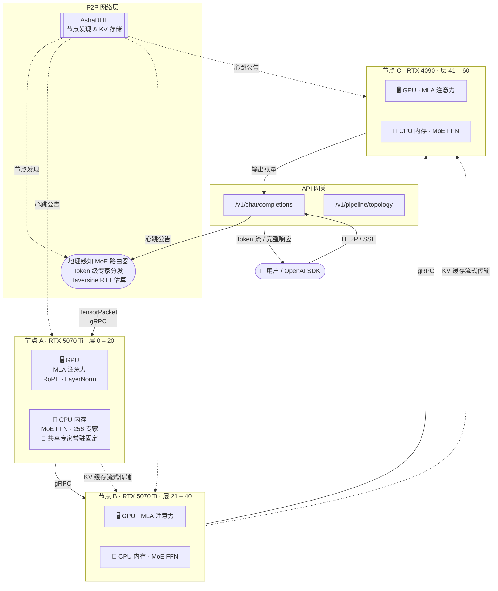

# Astra — DeepSeek-V4 P2P 分布式推理框架

<div align="right">
  <a href="README.md">English</a> ·
  <a href="README_zh.md"><b>中文</b></a>
</div>

[](LICENSE)
[](https://www.python.org)
[]()
[](.github/workflows/ci.yml)
[]()

**Astra** 是一个开源 P2P 分布式推理框架，能够将 **DeepSeek-V4-Flash（284B 参数）** 运行在由普通 PC 组成的集群上（例如配备 RTX 5070 Ti、16 GB 显存的设备）。其核心技术融合自：

- **[Petals](https://github.com/bigscience-workshop/petals)** 的去中心化流水线并行方案
- **[KTransformers](https://github.com/kvcache-ai/ktransformers)** 的 GPU/CPU 异构计算引擎
- **[hivemind](https://github.com/learning-at-home/hivemind)** DHT 协议，用于节点发现与键值存储

> **当前状态：Alpha 阶段。** 阶段 1（本地单机）与阶段 2（双节点 gRPC 流水线）已完成并通过测试。阶段 3（完整 P2P 网络 + API 网关）正在推进中。

---

## 平台支持

| 功能模块 | Linux | macOS | Windows |
|---------|:-----:|:-----:|:-------:|
| numpy stub 推理（无需 GPU） | ✅ 原生 | ✅ 原生 | ✅ 原生 |
| gRPC 流水线 | ✅ 原生 | ✅ 原生 | ✅ 原生 |
| OpenAI API 网关 | ✅ 原生 | ✅ 原生 | ✅ 原生 |
| `check_env.py` 环境检测 | ✅ 原生 | ✅ 原生 | ✅ 原生 |
| KTransformers C++ 内核 | ✅ 原生 | ⚠️ 需自行编译 | ⚠️ WSL2 + CUDA |

**Windows GPU 推理**需通过 WSL2 实现，详见[下方分步指南](#windows--gpu-推理via-wsl2)。  
**numpy stub 模式**（无 GPU）在三个平台均可直接运行，无需额外配置。

---

## 快速开始

跳转到对应平台：
- [Linux](#linux)
- [macOS](#macos)
- [Windows — 无 GPU（原生）](#windows--无-gpu原生)
- [Windows — GPU 推理 via WSL2](#windows--gpu-推理via-wsl2)

---

### Linux

```bash
# 1. 克隆并安装
git clone https://github.com/qchauncey/astra.git && cd astra
pip install -e ".[proto]"

# 2. 检查运行环境
python scripts/check_env.py

# 3. 运行 Mock 流水线（无需 GPU）
python mock_pipeline.py --seq-len 32 --hidden-dim 256

# 4. 启动节点（同时开启 OpenAI 兼容 API，端口 8080）
#    --hidden-dim 256 使用 mock 维度；真实模型省略此参数（默认 7168）
python scripts/run_node.py --node-id node-A --port 50051 \
    --layer-start 0 --layer-end 30 --hidden-dim 256 --api-port 8080

# 5. GPU 模式（需要 CUDA + KTransformers）
python scripts/run_node.py --node-id node-A --port 50051 \
    --layer-start 0 --layer-end 30 --gpu --api-port 8080
```

---

### macOS

Astra 在 macOS 上以 numpy stub 模式（纯 CPU）完整运行。KTransformers C++ 内核依赖 CUDA，不支持 Apple Silicon 和 Intel Mac。

```bash
# 安装 Homebrew（若尚未安装）：https://brew.sh
brew install python@3.11 git

git clone https://github.com/qchauncey/astra.git && cd astra
pip3 install -e ".[proto]"

python scripts/check_env.py
python mock_pipeline.py --seq-len 32 --hidden-dim 256

# 启动节点（numpy stub，无 GPU）
python scripts/run_node.py --node-id node-A --port 50051 \
    --layer-start 0 --layer-end 30 --hidden-dim 256 --api-port 8080
```

> **Apple Silicon 说明：** MPS（Metal Performance Shaders）后端尚未集成。Mac 上的完整 GPU 推理待后续 MPS 适配器支持，欢迎贡献。

---

### Windows — 无 GPU（原生）

直接在 PowerShell 或命令提示符中运行，numpy stub 模式无需 WSL2。

```powershell
# 安装 Python 3.10+：https://python.org（勾选"Add to PATH"）
# 安装 Git：https://git-scm.com

git clone https://github.com/qchauncey/astra.git
cd astra
pip install -e ".[proto]"

python scripts/check_env.py
python mock_pipeline.py --seq-len 32 --hidden-dim 256

# 启动节点（numpy stub，无 GPU）
python scripts/run_node.py --node-id node-A --port 50051 `
    --layer-start 0 --layer-end 30 --hidden-dim 256 --api-port 8080
```

---

### Windows — GPU 推理（via WSL2）

KTransformers 依赖 Linux + CUDA。在 Windows 上，WSL2 提供完整 Linux 内核并透传 GPU，Astra 在其中的运行与原生 Linux 完全一致。

**前置条件**
- Windows 10 21H2 或更高版本 / Windows 11
- NVIDIA GPU，驱动版本 ≥ 535（在 PowerShell 中执行 `nvidia-smi` 确认）

**第一步 — 启用 WSL2** *（以管理员身份运行 PowerShell）*

```powershell
wsl --install -d Ubuntu-22.04
# 按提示重启 Windows，然后从开始菜单打开"Ubuntu 22.04"
```

**第二步 — 安装 NVIDIA WSL2 CUDA 驱动** *（在 Windows 宿主机上，不是在 WSL 内）*

1. 从以下地址下载支持 WSL2 的显示驱动：https://developer.nvidia.com/cuda/wsl  
2. 在 **Windows** 上像普通驱动一样安装。  
3. **不要**在 Windows 上安装 CUDA Toolkit，Toolkit 只安装在 WSL2 内部。

**第三步 — 在 WSL2 Ubuntu 内安装 CUDA Toolkit**

```bash
# 以下命令在 WSL2 Ubuntu 终端内执行
wget https://developer.download.nvidia.com/compute/cuda/repos/ubuntu2204/x86_64/cuda-keyring_1.1-1_all.deb
sudo dpkg -i cuda-keyring_1.1-1_all.deb
sudo apt-get update
sudo apt-get install -y cuda-toolkit-12-4 build-essential python3-pip git

# 验证 GPU 可见
nvidia-smi
```

正常输出应显示 GPU 型号、驱动版本和 CUDA 版本。

**第四步 — 在 WSL2 内克隆并运行 Astra**

```bash
git clone https://github.com/qchauncey/astra.git && cd astra
pip3 install -e ".[proto]"

# 环境检查
python scripts/check_env.py

# Mock 流水线（纯 CPU，快速验证）
python mock_pipeline.py --seq-len 32 --hidden-dim 256

# 启动带 GPU 的节点
python scripts/run_node.py --node-id node-A --port 50051 \
    --layer-start 0 --layer-end 30 --gpu --api-port 8080
```

**WSL2 使用提示**

| 问题 | 说明 |
|------|------|
| 访问 Windows 文件 | WSL2 内通过 `/mnt/c/`、`/mnt/d/` 等路径访问 |
| 网络端口 | WSL2 端口在 Windows 侧通过 `localhost:<端口>` 访问，无需额外配置 |
| GPU 驱动 | 共享 Windows 宿主机驱动，**不要**在 WSL2 内单独安装 GPU 驱动 |
| 多机部署 | 每台 Windows 机器运行各自的 WSL2，gRPC 流水线与 Linux 原生行为一致 |
| 性能开销 | 相比裸机 Linux 约有 3–5% 额外开销，对内存带宽瓶颈的 MoE 负载影响可忽略 |

---

## 系统架构

### 网络拓扑



### 单节点计算拆分（KTransformers 异构模型）

```
┌─────────────────────────────────────────────────────────┐
│                    单个 Astra 节点                       │
│                                                          │
│  ┌──────────── GPU（16 GB 显存）────────────────────┐   │
│  │  多头潜在注意力（MLA）                            │   │
│  │  ├─ Q / K / V 投影    （融合 CUDA 算子）         │   │
│  │  ├─ RoPE 位置编码                                │   │
│  │  ├─ 缩放点积注意力                               │   │
│  │  └─ 输出投影 + 残差连接                          │   │
│  └───────────────────────────────────────────────────┘  │
│                       │ 隐藏状态（float16）              │
│                       ▼                                  │
│  ┌──────────── CPU 内存（≥ 64 GB）──────────────────┐   │
│  │  MoE FFN（KTransformers CPU 卸载）               │   │
│  │  ├─ 共享专家 0 & 1  ← 常驻固定，永不淘汰         │   │
│  │  ├─ 路由专家 2–255  ← LRU 分页，支持 NVMe mmap  │   │
│  │  └─ SiLU 门控 MLP: down( silu(gate(x)) * up(x) ) │  │
│  └───────────────────────────────────────────────────┘  │
│                       │ TensorPacket（gRPC）             │
│                       ▼  传输至下一节点                  │
└─────────────────────────────────────────────────────────┘
```

### 单节点硬件需求

| 子层 | 运行设备 | 显存 / 内存占用 |
|------|---------|----------------|
| MLA 注意力 + RoPE + LayerNorm | GPU 显存 | ~16 GB |
| 共享专家 0 & 1（每个 Token 必触发） | 常驻 GPU / 高速内存 | ~2 GB |
| 254 个路由专家（每 Token top-8） | CPU 内存 / NVMe mmap | ~530 GB（跨集群分布） |
| KV 缓存（每请求） | CPU 内存 | ~8 GB @ 8k 上下文 |

---

## 核心创新点

### 2.1 地理微集群调度
基于节点的物理位置（Haversine 大圆距离 + 传播延迟估算）将 MoE 专家请求优先分发到距离最近的节点，有效对冲 MoE 高频网络 I/O 造成的阻塞。

### 2.2 异构计算引擎（KTransformers 集成）
- **GPU** 负责：MLA 注意力层、RoPE、LayerNorm、DSA 算子
- **CPU/RAM** 负责：MoE 专家权重的 FFN 前向计算（全部 256 个专家权重常驻内存）
- 通过 `ASTRA_USE_KTRANSFORMERS=1` 激活真实 C++ 内核；默认使用 NumPy 存根，可在无 GPU 环境下完整运行

### 2.3 共享专家常驻（Shared Expert Pinning）
DeepSeek-V4 的 2 个共享专家在每个 Token 计算时必然触发。将其永久固定于 GPU 显存或高速内存中，彻底消除频繁的 PCIe 数据搬运开销。

### 2.4 存储分离（Engram 记忆节点）
基于 AstraDHT（hivemind DHT 的兼容替代），计算节点与 Engram 存储节点相互解耦，支持分布式 KV 缓存与模型权重分片的独立扩缩容。

---

## 项目结构

```
astra/
├── serialization/
│   └── tensor_pack.py          # TensorPacket 二进制传输格式 v1
├── inference/
│   ├── heterogeneous.py        # HeterogeneousEngine（GPU 注意力 + CPU MoE）
│   └── shared_expert_cache.py  # LRU 专家缓存，含永久固定策略
├── routing/
│   └── geo_router.py           # GeoAwareMoERouter（Token 级地理感知分发）
├── rpc/
│   ├── proto/inference.proto   # gRPC 服务定义
│   ├── generated/              # 自动生成的 pb2 存根
│   ├── server.py               # InferenceServer
│   ├── client.py               # InferenceClient（打包 → 传输 → 接收）
│   └── kv_transfer.py          # KV 缓存分块流式传输
├── network/
│   ├── dht.py                  # AstraDHT（hivemind 兼容节点发现）
│   └── orchestrator.py         # PipelineOrchestrator（N 节点 DHT 动态串联）
└── api/
    └── openai_compat.py        # OpenAI 兼容 FastAPI 接口

mock_pipeline.py                # 阶段 1 & 2 本地模拟测试入口
scripts/
├── run_node.py                 # 生产节点启动 CLI
└── check_env.py                # 环境依赖检查工具
tests/                          # 130 个 pytest 测试（全部通过）
.github/workflows/ci.yml        # CI：Python 3.10/3.11/3.12 矩阵 + lint
docs/
├── ARCHITECTURE.md             # 详细系统设计与传输格式规范
└── ROADMAP.md                  # 分阶段实施路线图
```

---

## 模块说明

| 模块 | 功能 |
|------|------|
| `astra.serialization.TensorPacket` | 二进制传输格式：隐藏状态 + 路由元数据，float16 |
| `astra.inference.HeterogeneousEngine` | 注意力层走 GPU 存根，MoE FFN 走 CPU 内存 |
| `astra.inference.SharedExpertCache` | LRU 缓存，专家 0 & 1 固定常驻，永不淘汰 |
| `astra.routing.GeoAwareMoERouter` | Token 级 `(token, expert_id) → 最优节点` 路由 |
| `astra.rpc.InferenceServer/Client` | gRPC 打包 → CRC32 校验 → 计算 → 反序列化 闭环 |
| `astra.rpc.KVCacheSender/Receiver` | KV 张量分块流式传输（≤3 MB/块） |
| `astra.network.AstraDHT` | 节点发现，可无缝替换为 `hivemind.DHT` |
| `astra.network.PipelineOrchestrator` | DHT 发现 → 层覆盖校验 → 重试安全的 N 跳串联 |
| `astra.api.openai_compat` | OpenAI `/v1/chat/completions` + SSE 流式接口 |

---

## 配套文档

| 文档 | 内容 |
|-----|-----|
| [docs/ARCHITECTURE.md](docs/ARCHITECTURE.md) | 系统设计、数据流、传输格式规范 |
| [docs/ROADMAP.md](docs/ROADMAP.md) | 分阶段实施计划 |
| [docs/TESTING.md](docs/TESTING.md) | 测试方案：已覆盖 130 项 + 待完成测试清单（含不可自动化的硬件测试项） |
| [docs/SECURITY.md](docs/SECURITY.md) | 节点间加密（mTLS）、隐藏状态隐私保护、输出完整性验证、差分隐私 |
| [docs/FEASIBILITY.md](docs/FEASIBILITY.md) | 算力门槛、地理微集群划分规则、带宽需求、与同类项目对比 |
| [docs/COMPLIANCE.md](docs/COMPLIANCE.md) | 所有依赖库的许可证合规分析、DeepSeek 模型使用条款、专利条款 |

---

## 实施路线图

| 阶段 | 内容 | 状态 |
|------|------|------|
| **Phase 1** | 本地异构单机推理打通（NumPy 存根 + SharedExpertCache） | ✅ 完成 |
| **Phase 2** | 局域网双机 gRPC 流水线（打包-传输-运算闭环） | ✅ 完成 |
| **Phase 3** | AstraDHT 节点发现、N 节点编排、OpenAI API、KV 缓存流传输 | 🔄 进行中 |
| **Phase 4** | 接入真实 KTransformers C++ 内核 + DeepSeek-V4 权重加载 | 📋 规划中 |
| **Phase 5** | gRPC TLS 安全认证 + hivemind 多机 DHT 集成 | 📋 规划中 |
| **Phase 6** | Next.js / Electron 前端门户，去中心化登录，算力监控 | 📋 规划中 |

---

## 开源协议

本项目采用 **Apache License 2.0** 协议发布，详见 [LICENSE](LICENSE)。

本项目参考并借鉴了 [Petals](https://github.com/bigscience-workshop/petals)（Apache 2.0）与 [KTransformers](https://github.com/kvcache-ai/ktransformers)（Apache 2.0）的设计思路。所有修改内容均在 [NOTICE](NOTICE) 文件及各源文件头部予以说明。

专利条款：Apache 2.0 协议内置专利反击条款，保护所有贡献异构算子及 P2P 协议的开发者。

---

## 参与贡献

欢迎提交 PR。新建文件时请包含 Apache 2.0 License 头部声明，并按 [NOTICE](NOTICE) 格式注明修改内容。
