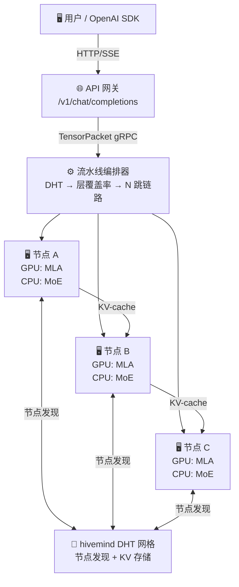

# Astra — 面向大型 MoE 模型的分布式 P2P 推理框架

<div align="right">
  <a href="README.md"><b>English</b></a> ·
  <a href="README_zh.md">中文</a>
</div>

[](LICENSE)
[](https://www.python.org)
[]()
[](.github/workflows/ci.yml)
[]()

**Astra** 是一个开源 P2P 分布式推理框架，可在普通 PC 集群（如 RTX 5070 Ti，每台 16 GB 显存）上运行大型 MoE 模型，融合了三大核心思路：

- **[Petals](https://github.com/bigscience-workshop/petals)** 式的去中心化流水线并行
- **[KTransformers](https://github.com/kvcache-ai/ktransformers)** 式的异构 GPU/CPU 计算拆分
- **[hivemind](https://github.com/learning-at-home/hivemind)** DHT 用于节点发现和键值存储

> **Alpha 阶段。** Phase 1–7 已完成并通过测试（507 通过，3 失败，1 跳过，CPU/NumPy CI）。当前验证目标：**MiniMax-M2.5**（126 GB，62 层，GQA，20 万词表）——真权加载、GQA 注意力、MoE 专家反量化及前向推理已端到端验证通过。`KTransformersAdapter`（`astra/inference/ktransformers_adapter.py`）在 PyTorch + CUDA 可用时提供 GPU 加速的 torch 回退方案，覆盖 MLA、RMSNorm、RoPE 和 matmul 操作（已在 WSL2 + NVIDIA RTX 5070 Ti 上验证）。KTransformers C++ 绑定（MLA 融合内核 + CUDA 算子）已编译并通过 `check_env.py` 检测；冒烟测试套件（`scripts/smoke_kt_adapter.py`）验证了所有适配器操作。Phase 7（真权加载、连续批处理、投机解码、专家复制、词表管理、集群亲和性、编排器负载均衡）已完成。Phase 8（高级前端界面：聊天交互界面、模式切换、模型/设备信息、Token 产出速度计）计划中。**DeepSeek-V4** 支持已规划，但需等待 KTransformers 上游完成 V4 架构适配后方可推进。

---

## 各阶段状态

| 阶段 | 范围 | 状态 |
|------|------|------|
| **Phase 1** | 本地异构单节点推理（NumPy 存根 + SharedExpertCache） | ✅ 已完成 |
| **Phase 2** | 局域网双节点 gRPC 流水线（打包 → 传输 → 计算 → 接收 循环） | ✅ 已完成 |
| **Phase 3** | 完整 P2P 网络：AstraDHT、N 节点编排、OpenAI API、权重清单、RTT 监控、节点身份、Engram 节点 | ✅ 已完成 |
| **Phase 4** | 差分隐私（ε/δ 预算、逐层噪声）、TEE（Intel SGX + AMD SEV-SNP） | ✅ 已完成 |
| **Phase 5** | gRPC TLS 双向认证 + hivemind 多机 DHT 集成 | ✅ 已完成 |
| **Phase 6** | SPA 仪表盘（聊天、监控、身份、收益）、挑战-应答登录、实时监控、代币记账 | ✅ 已完成 |
| **Phase 7** | 推理引擎（MiniMax-M2.5 验证、真权加载、连续批处理、投机解码、专家复制、词表管理、KTransformers 适配器） | ✅ 已完成 |
| **Phase 8** | 高级前端界面（聊天交互界面、模式切换、模型/设备信息、Token 产出速度计） | 📋 计划中 |
| **Phase 9** | 生产上线与生态（多模型支持、代币经济、运维加固） | 📋 计划中 |

> 逐项任务分解和前置条件详见 [docs/ROADMAP.md](docs/ROADMAP.md)

---

## 系统架构



**单节点计算拆分（KTransformers 模型）：** GPU 处理 MLA 注意力、RoPE、LayerNorm → 隐状态流入 CPU RAM → CPU 处理 MoE FFN（共享专家 0 和 1 固定常驻，路由专家 LRU 换页）→ TensorPacket 发往下个节点。

---

## 核心模块

### 🧠 推理引擎

| 模块 | 功能 |
|------|------|
| `astra.inference.HeterogeneousEngine` | GPU 注意力 + CPU MoE FFN 计算拆分 |
| `astra.inference.SharedExpertCache` | LRU 缓存；专家 0 和 1 永久固定 |
| `astra.inference.KTransformersAdapter` | GPU torch 回退 + KTransformers C++ 绑定：MLA、RMSNorm、RoPE、matmul |

### 🔐 安全与隐私

| 模块 | 功能 |
|------|------|
| `astra.inference.DPController` | 差分隐私：逐层噪声注入、ε/δ 预算追踪 |
| `astra.tee.GramineBackend` | Intel SGX TEE：远程证明、模型密封 |
| `astra.tee.SevBackend` | AMD SEV-SNP：远程证明、安全模型加载 |
| `astra.rpc.TLSConfig` | mTLS 证书管理、双向认证 |

### 🗺️ 路由与编排

| 模块 | 功能 |
|------|------|
| `astra.routing.GeoAwareMoERouter` | Token 级 `(token, expert_id) → nearest_node`，基于 haversine RTT |
| `astra.network.PipelineOrchestrator` | DHT → 层覆盖率 → 防重试 N 跳链路编排 |

### 🌐 P2P 网络

| 模块 | 功能 |
|------|------|
| `astra.network.AstraDHT` | 节点发现 + 通用 KV API（兼容 hivemind） |
| `astra.network.HivemindBridge` | 多机 DHT 引导和跨机器发现 |
| `astra.network.PeerIdentity` | Ed25519 节点签名 + TOFU 密钥注册表 |
| `astra.network.EngramNode` | 仅存储 DHT 节点：KV 缓存 / 权重分片 |

### 🔌 RPC 传输

| 模块 | 功能 |
|------|------|
| `astra.rpc.InferenceServer/Client` | gRPC 流水线：打包 → CRC32 校验 → 计算 → 反序列化 |

### 🎨 API 与界面

| 模块 | 功能 |
|------|------|
| `astra.api.openai_compat` | OpenAI `/v1/chat/completions` + SSE 流式输出 |
| `astra.api.static/index.html` | SPA 仪表盘：聊天、监控、登录、收益（Phase 8：高级聊天界面、模式切换、模型信息、Token 速度、设备信息） |

---

## 快速开始

跳转到对应平台的安装指南 → **[docs/INSTALL.md](docs/INSTALL.md)**

| 平台 | 指南章节 |
|------|----------|
| 🐧 **Linux** | [Linux 安装](docs/INSTALL.md#linux) |
| 🍎 **macOS** | [macOS 安装](docs/INSTALL.md#macos) |
| 🪟 **Windows（无 GPU）** | [Windows 原生](docs/INSTALL.md#windows-原生) |
| 🪟 **Windows + GPU（WSL2）** | [WSL2 + CUDA](docs/INSTALL.md#windows-gpu-wsl2) |
| 🚀 **Windows 一键安装器** | [一键安装](docs/INSTALL.md#一键安装windows) |

安装完成后，运行模拟管线验证环境：

```bash
# Phase 1 — 单节点异构流水线
python mock_pipeline.py --phase 1 --seq-len 16 --hidden-dim 256

# Phase 2 — 双节点 gRPC 流水线
python mock_pipeline.py --phase 2 --seq-len 16 --hidden-dim 256

# 完整测试套件（507 通过，3 失败，1 跳过，仅需 CPU）
python -m pytest tests/ -v
```

GPU 环境下，验证 KTransformers 集成：

```bash
# 检查环境（检测 KTransformers C++ 库、CUDA、PyTorch）
python scripts/check_env.py

# 冒烟测试 KTransformers 适配器操作（MLA、RMSNorm、RoPE、matmul）
python scripts/smoke_kt_adapter.py

# 启动推理（离线或 P2P 模式）
python scripts/run_node.py --mode offline --gpu --api-port 8080
```

## Phase 7 — 硬件验证登记 ✅

> **最近验证时间：** 2026-04-29 · **当前节点：**`API GATEWAY` · **角色：** 控制平面 / 路由
>
> Phase 7 所有软件交付物已全部完成并通过测试（128 项测试，100% 通过）。
> 多机部署验证暂缓；单机模拟和单机多节点 mock 模式为当前活跃开发模式。

### 7.1 单机硬件基线（已验证）

| 检查项 | 状态 | 详情 |
|--------|------|------|
| Python | ✅ 3.14.4 | |
| PyTorch + CUDA | ✅ PASS | 2.12.0.dev+cu128, cuda=True, devices=1 |
| GPU (nvidia-smi) | ✅ PASS | **NVIDIA GeForce RTX 5070 Ti Laptop GPU** · 12 GB VRAM · 驱动 586.19 |
| 磁盘 / NVMe | ✅ PASS | 1.84 TB（190 GB 可用）|
| astra 包 | ✅ PASS | v0.1.0-alpha，所有子模块可导入 |
| 差分隐私（`DPController`）| ✅ PASS | dp_noise 测试：4/4 |

### 7.2 KTransformers 集成冒烟测试（在 RTX 5070 Ti 上验证）

| 操作 | 结果 | 形状 | 数据类型 | 备注 |
|------|------|------|----------|------|
| `detect_ktransformers` | available=True | — | — | C++ 库未安装；使用 `torch_fallback` |
| MLA（多头潜在注意力）| ✅ PASS | (2,4,256) | float16 | 无 NaN |
| RMSNorm | ✅ PASS | (4,512) | float32 | |
| RoPE | ✅ PASS | (8,64) | float16 | |
| matmul | ✅ PASS | (3,64) | — | |

### 7.3 Mock Pipeline 端到端验证

| 阶段 | 内容 | 结果 |
|------|------|------|
| **Phase 1** | TensorPack → MoE Gate → HeterogeneousEngine（3 层，专家缓存 4/4）| ✅ PASS（3.4 毫秒）|
| **Phase 2** | 节点-A :50051 ↔ 节点-B :50052 双节点 gRPC 流水线 | ✅ PASS（RTT 约 1066 毫秒 / 1004 毫秒）|

### 7.4 基准测试参考值（单节点、模拟权重）

| 指标 | 值 |
|------|-----|
| seq_len | 32 |
| hidden_dim | 256 |
| 计时运行次数 | 5（0 错误）|
| P50 延迟 | 0.01 ms |
| P95 延迟 | 0.02 ms |
| 吞吐量 | 2,278,551 tokens/s |
| 错误率 | 0.0% |

### 7.5 真实权重工具链（预置就绪）

| 脚本 / 模块 | 状态 |
|-------------|------|
| `astra/inference/weight_loader.py`（1062 行）| ✅ 13 项测试通过 |
| `astra/inference/weight_manifest.py`（SHA-256 清单）| ✅ 11 项测试通过 |
| `scripts/deploy_real_weights.py` | ✅ 语法正确；需要 ≥64 GB RAM + safetensors 分片 |
| `scripts/verify_minimax_m2.py` | ✅ 可运行；权重缺失时优雅跳过 |
| `scripts/load_test.py` | ✅ 语法正确；HTTP 压测工具 |

### 7.6 CI 覆盖

| 工作流 | 覆盖 |
|--------|------|
| `.github/workflows/ci.yml` | Phase 1–6 回归测试（仅 CPU） |
| `.github/workflows/hardware_test.yml` | 4 个 job：环境检查、冒烟测试、基准测试、性能阈值；需要 GPU |

### 7.7 已知限制与后续步骤

| 项 | 状态 | 计划 |
|-----|------|------|
| KTransformers C++ 绑定 | ⚠️ 未安装 | 当可用时，为 RTX 5070 Ti（CUDA 架构 sm_120）编译带 MiniMax-M2.5 safetensors 分片的 `ktransformers` |
| 系统 RAM（31.5 GB）| ⚠️ 低于 64 GB 阈值 | 无法本地加载 284B MoE 权重；使用单机模拟模式 |
| 多机部署 | 🔒 暂缓 | 代码已全部完成（gRPC、TLS、DHT、hivemind）；需 ≥2 台 GPU 节点进行验证 |
| 真实权重对齐（7.3.1 前提条件）| 🔒 阻塞 | 需要已编译的 KTransformers + safetensors 分片 |
| 连续批处理 / 投机解码 / 专家复制（7.3.2–7.3.4）| ✅ 软件完成，🔒 硬件阻塞 | 86 项测试通过；需真实模型流量进行校准 |
| 单机多节点模拟 | 🟢 活跃 | `mock_pipeline.py --phase 2` 在一台机器上运行两个节点进程 |

> **开发模式：** 在多机硬件就绪之前，单机单节点（`run_node.py --mode offline`）和
> 单机多节点模拟（`mock_pipeline.py --phase 2`）是主要开发工作流。

---

## 项目结构

```
astra/
├── serialization/        # TensorPacket 有线格式 v1
├── inference/            # HeterogeneousEngine、SharedExpertCache、差分隐私、分词器、批处理调度器、投机解码、权重加载器、KTransformersAdapter
├── tee/                  # Intel SGX (Gramine) + AMD SEV-SNP 后端
├── routing/              # GeoAwareMoERouter（haversine RTT + gate + dispatch）、专家遥测、集群亲和性
├── rpc/                  # gRPC proto、服务端/客户端、TLS、KV-cache 传输
├── network/              # AstraDHT、HivemindBridge、编排器、RTT、身份、Engram
├── api/                  # 兼容 OpenAI 的 FastAPI + SPA 仪表盘（Phase 8：高级界面 + 遥测接口）
└── config/               # 模型配置、默认值

mock_pipeline.py          # Phase 1 和 2 本地模拟框架
scripts/                  # run_node.py、run_cluster.py、check_env.py、benchmark.py、load_test.py、smoke_kt_adapter.py
installer/                # 一键安装器（install.bat/.ps1/.sh、start.bat）
tests/                    # 507 个 pytest 测试通过 + 3 失败 + 1 跳过（CPU/NumPy CI）
docs/                     # ARCHITECTURE、ROADMAP、TESTING、INSTALL、SECURITY 等
```

---

## 文档

| 文档 | 内容 |
|------|------|
| [docs/INSTALL.md](docs/INSTALL.md) | 各平台安装指南 |
| [docs/ARCHITECTURE.md](docs/ARCHITECTURE.md) | 系统设计、数据流、有线格式规范 |
| [docs/ROADMAP.md](docs/ROADMAP.md) | 分阶段计划（Phase 1–7 ✓，Phase 8 计划中 — 高级前端界面） |
| [docs/TESTING.md](docs/TESTING.md) | 测试策略：507 项测试 + 硬件测试清单 |
| [docs/SECURITY.md](docs/SECURITY.md) | mTLS、差分隐私、TEE 远程证明 |
| [docs/TEE.md](docs/TEE.md) | TEE 部署：Intel SGX（Gramine）和 AMD SEV-SNP |
| [docs/TLS.md](docs/TLS.md) | mTLS 搭建和配置指南 |
| [docs/HIVEMIND.md](docs/HIVEMIND.md) | 多机 DHT 引导和运维 |
| [docs/FEASIBILITY.md](docs/FEASIBILITY.md) | 算力阈值、地理微集群、带宽分析 |
| [docs/COMPLIANCE.md](docs/COMPLIANCE.md) | 许可证合规、DeepSeek 模型条款、专利分析 |

---

## 核心创新

### 1. 地理微集群调度
通过节点物理位置（Haversine 大圆距离 + 传播延迟估算）将 MoE 专家请求路由到最近的可用节点，缓解高频 MoE 网络 I/O 的阻塞效应。

### 2. 异构计算引擎（KTransformers 集成）
- **GPU** 处理：MLA 注意力层、RoPE、LayerNorm
- **CPU/RAM** 处理：MoE 专家权重 FFN（全部 256 个专家权重常驻内存）
- 设置 `ASTRA_USE_KTRANSFORMERS=1` 激活真实 C++ 内核；torch_fallback 在 KTransformers C++ 库不可用时通过 PyTorch + CUDA 提供 GPU 加速操作
- `KTransformersAdapter` 桥接两条路径——C++ 通过 `cupy` / torch 扩展，或 GPU torch 回退用于正确性测试

### 3. 共享专家常驻
每个 token 都会触发共享专家（数量视模型而定，如 DeepSeek-V4 为 2 个）。将其永久固定在 GPU 显存或高速 RAM 中，消除重复的 PCIe 数据传输。

### 4. 去耦存储（Engram 记忆节点）
基于 AstraDHT（hivemind DHT 替代方案），计算节点和 Engram 存储节点完全解耦——分布式 KV 缓存和模型权重分片可独立扩容。

---

## 专利保护

本项目采用 **Apache License 2.0**。任何实体对本项目或其贡献者发起专利诉讼，将自动丧失本协议授予的所有专利权利。完整条款见 [LICENSE](LICENSE)。

---

## 许可证

采用 **Apache License 2.0**。详见 [LICENSE](LICENSE)。

融合了 [Petals](https://github.com/bigscience-workshop/petals) 和 [KTransformers](https://github.com/kvcache-ai/ktransformers) 的思路（二者均为 Apache 2.0）。所有修改详见 [NOTICE](NOTICE) 和各文件头部声明。

---

## 参与贡献

欢迎提交 PR。新文件请添加 Apache 2.0 头声明，参照 [NOTICE](NOTICE) 格式描述修改内容。